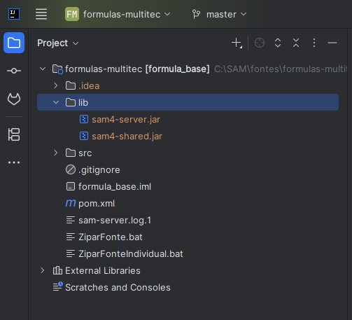
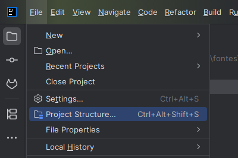
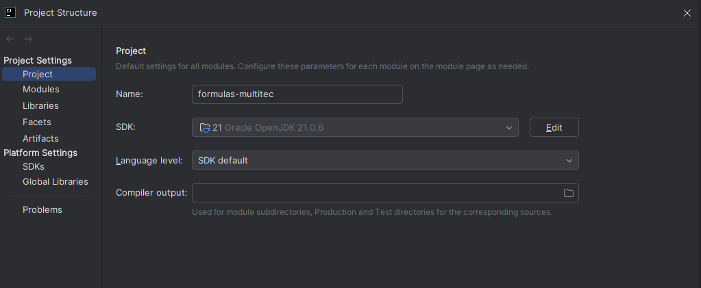
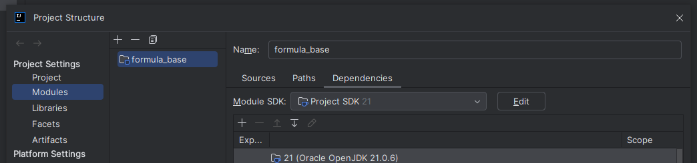
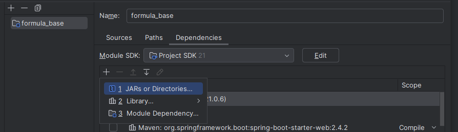
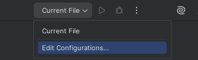
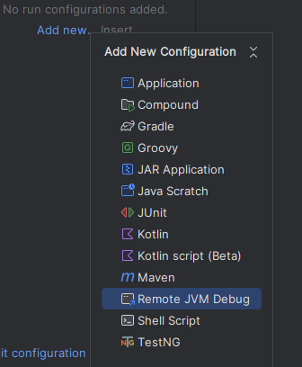
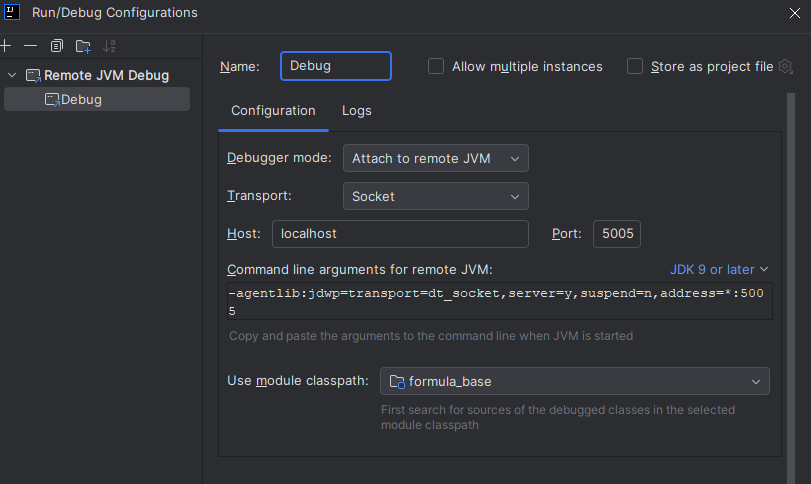
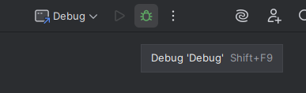

# Debug de Formulas

É possível debugar formulas, relatorios e interceptadores.

## Requisitos

- Intellij
- Java 21

## Primeiros passos

1. Baixar o projeto base nos arquivos da Task.
2. Baixar a biblioteca das formulas da Task.

## Importar o projeto

1. No intellij abra o menu File->Open selecione a pasta do projeto das formulas.
2. Dentro do Intellij crie uma pasta chamada lib na pasta raiz do projeto.
3. Copie os arquivos sam4-server.jar e sam4-shared.jar da biblioteca das formulas na pasta lib.

=== "Imagem 1"

    

## Configurando o Projeto

1. Configurando o JDK do Java
    - Abra o Menu File->Project Structure.
    - Em Project selecione o JDK do java 21.
    - Aplique as alterações.

    === "Imagem 1"

        

    === "Imagem 2"

        

2. Configurando as dependencias
    - Ainda em File->Project Structure navegue até a aba Modules.
    - Selecione o projeto.
    - Na opção + selecione JARs or Directories
    - selecione os dois JARs da pasta lib
    - Aplique as alterações

    === "Imagem 1"

        

    === "Imagem 2"

        

3. Salve e compile o projeto

## Atualizando a biblioteca das formulas

1. Substitua os dois JARs da pasta lib pelos JARs da nova versão, normalmente apenas esse passo resolve, mas pode precisar seguir os demais passos.
2. Em File->Project Structure navegue até a aba Modules.
3. Selecione o projeto.
4. Ache e remova os dois JARs na lista de dependencias.
5. Adicione os dois novos JARs.
6. Salve e compile o projeto.

## Iniciando o Debug

1. Iniciando o Servidor do SAM4 em modo Debug, utilize o .bat abaixo
    - Substitua "C:\FonteSam4\formulas_multitec" pelo caminho do seu projeto de formulas
    - Salve o arquivo .bat dentro da pasta do SAM4Server.

    ```bat
    java -agentlib:jdwp=transport=dt_socket,server=y,suspend=n,address=*:5005 -D"multitec.formula-dev-dir"="C:\FonteSam4\formulas_multitec" -D"spring.profiles.active=development" -jar ./lib/SAM4Servidor-executavel.jar
    ```
2. Configurando o Intellij
    - Abra as configurações de debugs em Edit Configurations.
    - Adicione uma nova configuração do tipo Remote JVM Debug.
    - Renomeie a configuração e aplique.
    - Inicie o debug no intellij.

    === "Imagem 1"

        

    === "Imagem 2"

        

    === "Imagem 3"

        

    === "Imagem 4"

        