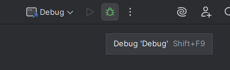

# Debug de Script de operações

É possível fazer o debug de um script de operações.

## Requisitos

1. Intellij
2. Java 21

## Primeiros passos

1. Crie um novo projeto java meven pelo Intellij com java 21.
2. Crie uma paswta lib na raiz do projeto.
3. Copie o JAR executavel do SAM$Cliente para a pasta lib.

=== "Imagem 1"

    

=== "Imagem 2"

    

## Configurando

1. Configurando a dependencia
    - Em File->Project Structure navegue até a aba Modules.
    - Selecione o projeto.
    - Na opção + selecione JARs or Directories
    - selecione o JAR da pasta lib
    - Aplique as alterações

    === "Imagem 1"

        

    === "Imagem 2"

        

2. Crie um package chamado main e scripts.

    === "Imagem 1"

        

3. No arquivo Main.java chame a classe Main do SAM4Cliente.

    ``` java
        package main;
        public class Main {
            public static void main(String[] args) {
                sam.swing.Main.main(args);
            }
        }
    ```

4. No arquivo Script.groovy no package script, a classe deve extender o classe ScriptBase do SAM.
    
    Nesse arquivo ficará o script a ser debugado.

    !!! Nota
        O codigo desse script precisa ser igual no intellij e na tela do SAM, qualquer alteração feita aqui precisa ser feita na tela da
        tarefa, como se fosse um script normal, precisa salvar, compilar, fechar e abrir a tela.

    ```java
        package scripts

        import multitec.swing.core.MultitecRootPanel
        import sam.swing.ScriptBase

        class Script extends ScriptBase{
            @Override
            void execute(MultitecRootPanel panel) {
            }

            @Override
            void preSalvar(boolean salvo) {
            }

            @Override
            void posSalvar(Long id) {
            }
        }
    ```

5. Salve e compile o projeto

## Atualizando o SAM4Cliente

1. Substitua o JAR da pasta lib pelo JAR da nova versão, normalmente apenas esse passo resolve, mas pode precisar seguir os demais passos.
2. Em File->Project Structure navegue até a aba Modules.
3. Selecione o projeto.
4. Ache e remova o JAR na lista de dependencias.
5. Adicione o novo JAR.
6. Salve e compile o projeto.

## Iniciando o Debug

1. Configurando o Intellij
    - Abra as configurações de debugs em Edit Configurations.
    - Adicione uma nova configuração do tipo Aplication.
    - Renomeie a configuração.
    - Selecione o JDK do java 21.
    - Selecione tambem a classe Main do projeto.
    - Aplique as alterações.
    - Inicie o debug no intellij.

    === "Imagem 1"

        

    === "Imagem 2"

        
    
    === "Imagem 3"

        
