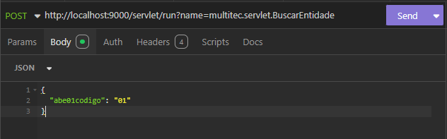
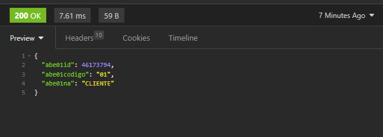
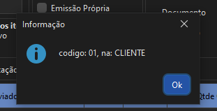

# Exemplo Servlet

Faremos um Servlet para buscar uma entidade pelo código recebido pelo corpo da requisição.

## Criando um servlet

Para criar um servlet abra o SAMDev, escolha o package, clique com o `botão direito`->`Novo`->`Servlet`


Criará uma classe padrão

``` java
public class BuscarEntidade extends ServletBase {
	
	@Override
	public String getNome() throws Exception {
		return null;
	}

	@Override
	public DashboardMetadata getMetadata() throws Exception {
		return null;
	}

	@Override
	public ResponseEntity<Object> executar() {
		return ResponseEntity.ok()
			.contentType(MediaType.APPLICATION_JSON)
			.body(null);
	}
}
```

- `getNome` : Retorna o nome do Servlet.
- `getMetadata` : Retorna dados do Servlet.
- `executar` : função onde ficará a lógica do Servlet.

## Buscando a entidade

Vamos alterar o método executar para receber o código, buscar a entidade e retornar a entidade pelo response da requisição.

``` java
class BuscarEntidade extends ServletBase{
    @Override
    String getNome() throws Exception {
        return "Buscar Entidade"
    }

    @Override
    DashboardMetadata getMetadata() throws Exception {
        return null
    }

    @Override
    ResponseEntity<Object> executar() throws Exception {
        String req = httpServletRequest.getReader().lines().collect(Collectors.joining());
        TableMap body = JSonMapperCreator.create().read(req, new TypeReference<TableMap>() {});

        String abe01codigo = body.getString("abe01codigo");
	   
	   Abe01 abe01 = getSession().createCriteria(Abe01.class)
                .addFields("abe01id, abe01codigo, abe01na")
                .addWhere(Criterions.eq("abe01codigo", abe01codigo))
                .get(ColumnType.ENTITY)

        return ResponseEntity.ok()
                .contentType(MediaType.APPLICATION_JSON)
                .body(abe01);
    }
}
```

- `httpServletRequest.getReader().lines().collect(Collectors.joining());` : Lê todo o conteúdo do corpo da requisição HTTP (geralmente enviado via POST ou PUT) como uma única String. 

- `TableMap body = JSonMapperCreator.create().read(req, new TypeReference<TableMap>() {});` : Faz o parse do JSON (contido na string req) para um objeto da classe TableMap.

## Acessando o Servlet

### Acessando via Insomnia

Realizando uma request para o servlet usando um programa externo como o Insomnia

=== "Request e Header"
    
    

=== "Retorno"
    

### Acessando via Script de operações

=== "Script"
    ``` java
    public class ScriptAntigo extends ScriptBase {
        MultitecRootPanel tarefa
        @Override
        void execute(MultitecRootPanel panel) {
            tarefa = panel
            criarMenu("Servlet", "Buscar Entidade", e -> buscarEntidade(), null)
        }

        private void buscarEntidade(){
            String json = '{"abe01codigo": "01"}'
            ObjectMapper mapper = new ObjectMapper();
            JsonNode body = mapper.readTree(json);
            WorkerRequest.create(this.tarefa.getWindow())
            .initialText("Buscando Entidade")
            .dialogVisible(true)
            .controllerEndPoint("servlet")
            .methodEndPoint("run")
            .param("name", "equilibrio.separador.BuscarEntidade")
            .header("ignore-body-decrypt", "true")
            .parseBody(body)
            .success((response) -> {
                Abe01 abe01 = response.parseResponse(new TypeReference<Abe01>(){});
                exibirInformacao("codigo: " + abe01.abe01codigo + ", na: " + abe01.abe01na)
            })
            .post();

        }
    }
    ```

=== "Retorno"
    