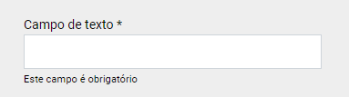
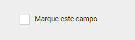
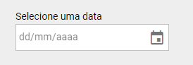
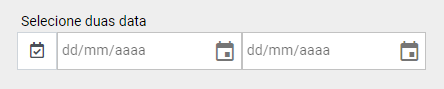
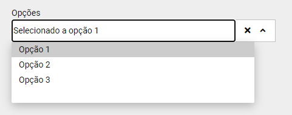
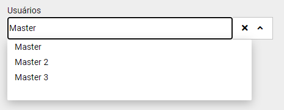
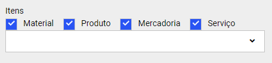
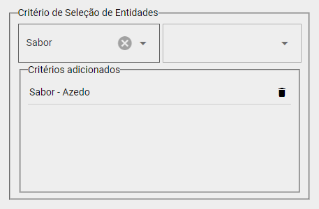

# Listagens

## Introdução

A geração de listagens é uma funcionalidade essencial para apresentar dados de forma estruturada e fácil de interpretar, suportando a tomada de decisão. Este guia detalha como o sistema realiza a extração de informações da base de dados, formata listagens e emprega componentes e métodos específicos para atender às necessidades de diversos relatórios.


## Extração de Dados

O processo de Extração de Dados consiste em se comunicar com bancos de dados para capturar os registros que serão disponibilizados para geração de relatórios. Todas as extrações são realizadas por meio de consultas SQL ou chamadas a procedimentos armazenados, e podem incluir:

- Consultas livres
- Listagens gerais ou filtradas
- Relatórios resumidos ou analíticos
- Estatísticas e métricas customizadas
- Documentos fiscais e não fiscais

Os dados extraídos devem ser precisos, atualizados e refletir o estado real do sistema.

**Fluxo de extração**:

1. Definição dos parâmetros de consulta (datas, filtros, agrupamentos).
2. Execução da query.
3. Validação e tratamento dos dados.
4. Conversão dos resultados para o formato PDF ou XLS.

## Componentes

Estes componentes são baseados na sintaxe das tags HTML, são construidos a partir do framework [VUE.js](https://br.vuejs.org/v2/guide/index.html) e podem ser utilizados para a criação de filtros que são utilizados nos processos de Extração de Dados.

### Atributos Default

----

Assim como nas tags do HTML os componentes Multitec também possuem seus atributos. Todos os componentes por default possuem os seguintes atributos para a sua configuração.

| Nome         | Descrição                                          | Valores Permitidos | Valor Default |
| ------------ | -------------------------------------------------- | ------------------ | ------------- |
| label        | Label para o campo                                 | *                  | -             |
| help         | Texto de ajuda para o campo                        | *                  | -             |
| id           | ID do campo                                        | *                  | -             |
| wrapperClass | Classe (css) para a DIV wrapper do input           | *                  | -             |
| showWrapper  | Indica se a DIV wrapper do componente será exibida | *                  | -             |
| required     | Indica se esse campo é requerido                   | true, false        | false         |
| v-model      | Nome do componente, utilizado para obter seu valor | *                  | -             |

### `m-input`

----

Este componente renderiza um campo `input` para textos, com os seguintes atributos:

| Nome         | Descrição               | Valores Permitidos                | Default |
| ------------ | ------------------------| --------------------------------- | ------- |
| type         | Tipo do conteúdo aceito | text, integer, decimal, monthYear | -       |

Exemplo:



``` html
<m-input type="text" label="Campo de texto" help="Campo obrigatório" v-model="filtros.texto" :required="true" />
```

### `m-check`

----

Este componente renderiza um campo `checkbox`, com os seguintes atributos:

| Nome         | Descrição                                          | Valores Permitidos     | Valor Default |
| ------------ | -------------------------------------------------- | ---------------------- | ------------- |
| option       | Define qual o valor será enviado para o modelo     | *                      | true          |
| inline       | Define se será renderizado sem quebra de linha     | false, true            | false         |
| multiple     | Agrupa os CheckBox com o mesmo nome em um array    | false, true            | false         |

Exemplo:



``` html
<m-check label="Marque este campo" v-model="filtros.texto" :required="true" />
```

### `m-radio`

----

Este componente renderiza um campo `radio`, com os seguintes atributos:

| Nome         | Descrição                                          | Valores Permitidos     | Valor Default |
| ------------ | -------------------------------------------------- | ---------------------- | ------------- |
| option       | Define qual o valor será enviado para o modelo     | *                      | true          |
| inline       | Define se será renderizado sem quebra de linha     | false, true            | false         |

Exemplo:


``` html
<m-radio label=" Marque este campo" option="0" v-model="filtros.texto" :required="true" />
```	
### `m-date`

----

Este componente renderiza um campo `input` do tipo `date`, com os seguintes atributos:

| Nome         | Descrição                                          | Valores Permitidos     | Valor Default |
| ------------ | -------------------------------------------------- | ---------------------- | ------------- |
| format       | Função destinada para a formatação de datas        | Function (JavaScript)  | -             |
| min          | Menor data permitida para o componente             | dd/MM/yyyy             | -             |
| max          | Maior data permitida para o componente             | dd/MM/yyyy             | -             |

Exemplo:



``` html
<m-date min="01/01/2000" max="31/12/2100" label="Selecione uma data" v-model="filtros.data" :required="true" />
```

### `m-date-interval`

----

Exibe um painel para informar um intervalo de datas, os atributos são iguais aos do m-date.

Exemplo:



``` html
<m-date-interval min="01/01/2000" max="31/12/2100" label="Selecione duas data" v-model="filtros.data" :required="true" />
```

### `m-selec`

----

Exibe um componente que pode ser renderizado como um ComboBox ou como um AutoComplete.

| Nome                | Descrição                                            | Valores Permitidos | Valor Default |
| ------------------- | --------------------------------------------------   | ------------------ | ------------- |
| multiple            | Indica se é permitido selecionar mais de um elemento | true, false        | false         |
| placeholder         | Texto exibido quando nenhum item está selecionado    | *                  | -             |
| selectFirstOnLoad   | Seleciona o primeiro elemento quando renderizado     | true, false        | false         |
| showClearButton     | Indica irá exibir o botão limpar                     | true, false        | true          |
| options             | Array de objetos que serão exibidos no ComboBox      | Array[Object]      | -             |
| adicionaWherePadrao | indica se deve adicionar o where padrão à select     | true, false        | true          |
| request             | Define como os dados para o componente serão obtidos | Object             | -             |

!!! Nota

    Para entender melhor o atributo `adicionaWherePadrao` veja nosso manual, nos tópicos: [Tabelas](http://samdoc.info/manuald?id=57791), [Grupos Centralizadores](http://samdoc.info/manuald?id=45814) e [Uso dos Registros](http://samdoc.info/manuald?id=13726). 

Existem duas maneiras de se preencher um ComboBox, através de dados fixos ou através de registros vindo do banco de dados, veja como realizar estas duas opções:

#### Atributo options

----

Este atributo permite iniciar o componente `m-select` com algumas opções default, estas opções podem ser definidas através do atributo `options`.

O Objeto do Array pode ter 3 propriedades:

- **value**: Valor que será enviado para o model.
- **label**: Valor que será exibido no componente quando selecionado.
- **option**: Texto que será exibido quando a caixa do ComboBox for aberta.

Exemplo:



=== "HTML"

	``` html
	<m-select label="Opções" :multiple="false" placeholder="Selecione uma opção" :options="opcoes" />
	```

=== "JS"

	``` javascript
	const classe = {
		data: {
			opcoes: [
				{value: 0, label: 'Opção 1', option: 'Selecionado a opção 1'},
				{value: 1, label: 'Opção 2', option: 'Selecionado a opção 1'},
				{value: 2, label: 'Opção 3', option: 'Selecionado a opção 1'},
			] 
		},
		onLoad: function () {},
		methods: {}
	}
	```

#### Atributo request

----

Esse atributo define como os dados para o ComboBox serão obtidos no Servidor.

O Objeto do Array pode ter 4 propriedades:

- **table**: Indicando qual a tabela da select.
- **columns**: Lista de colunas separadas por virgula.
- **data**: Indica se a select conterá JOIN ou WHERE.
	- **join**: Array definido por chave e valor da seguinte forma:
		- **inner**: Indica que o valor referente a chave inner será implementado como um INNER JOIN.
		- **left**: Indica que o valor referente a chave left será implementado como um LEFT JOIN.
	- **where**: Array definido por chave e valor da seguinte forma:
		- **nome**: Nome do campo a ser constituído com o seu valor no WHERE.
		- **valor**: Valor a ser comparado no WHERE.
	- **customWhere**: String contendo uma condição WHERE livre.
- **iniFimColumn**: Por padrão o retorno do componente `m-select` é o campo ID da tabela. Esta propriedade altera a coluna que virá no resultado da request.
	
Exemplo:



=== "HTML"

	``` html
	<m-select label="Usuários" :multiple="false" placeholder="Selecione uma opção" :request="request" />
	```

=== "JS"

    ``` javascript
	const classe = {
		data: {
			request: {
				table: 'aab10',
				columns: 'aab10nome, aab10email',
				data : {
					 join : { inner : 'aab10emprDefault' , left : 'aab10credSamPalm' }, 
					 where : { aab10user : 'MASTER'},
					 customWhere : 'AND aab10id = 5000'
				}
				
			}
		},
		onLoad: function () {},
		methods: {}
	}
	```
### `m-panel-check-mpms`

----

Este componente exibe um painel com 4 Checkbox que são utilizados para filtrar os registros de um `m-select` por **Material, Produto, Mercadoria** ou **Serviço**.

!!! Nota
    Para entender melhor o componente `m-panel-check-mpms` veja nosso manual, no tópico: [Itens > Tipos de Itens](http://samdoc.info/manuald?id=61269).
	
| Nome           | Descrição                                             | Valores Permitidos | Valor Default |
| -------------- | ----------------------------------------------------- | ------------------ | ------------- |
| selectRef      | Indicando qual o REF do m-select que deseja controlar | true, false        | -             |
| showMaterial   | Indica se irá exibir o check de Material              | *                  | true          |
| showProduto    | Indica se irá exibir o check de Produto               | true, false        | true          |
| showMercadoria | Indica se irá exibir o check de Mercadoria            | true, false        | true          |
| showServico    | Indica se irá exibir o check de Serviço               | true, false        | true          |

Exemplo:



=== "HTML"
	``` html
	<m-panel-check-mpms selectRef="selectItem" />
	<m-select label="Itens" :multiple="false" ref="selectItem" :request="request" />
	```
	
=== "JS"
	``` javascript
	const classe = {
		data: {
			request: {
				table: 'abm01',
				columns: 'abm01codigo, abm01na',
			}
		},
		onLoad: function () {},
		methods: {}
	}
	```

### `m-panel-criterio`

----

Este componente exibe um painel que permite a utilização dos critérios de seleção nos filtros.

!!! Nota
    Para entender melhor o componente `m-panel-criterio` veja nosso manual, no tópico: [Critérios de Seleção](http://samdoc.info/manuald?id=57806).

| Nome | Descrição                            | Valores Permitidos           | Valor Default |
| ---- | ------------------------------------ | ---------------------------- | ------------- |
| tipo | Informa qual a aplicação do critério | entidade, item, trabalhador  | -             |

Exemplo:



``` html
<m-panel-criterio tipo="entidade" v-model='filtros.criterios' />
```


## Métodos

Para facilitar o desenvolvimento das listagens o SAM conta com vários métodos para realizar os mais diversos tipos de processos.

!!! Nota
	A partir de agora veremos alguns termos que são exclusivos do SAM, recomendamos fortemente que você leia e conheça um pouco mais sobre a estrutura do SAM. Visite nosso [manual](http://samdoc.info/manuald?id=57762).
	
### `obterEmpresaAtiva`
----
Este método retorna um objeto do tipo Aac10 contendo os dados da empresa ativa.

=== "Exemplo"
    ``` java
    Aac10 aac10 = obterEmpresaAtiva()
    ```

### `obterUsuarioLogado`
----
Este método retorna um objeto do tipo Aab10 contendo os dados do usuário logado no sistema.

=== "Exemplo"
    ``` java
    Aab10 aab10 = obterUsuarioLogado()
    ```

### `getAcessoAoBanco`
---
Este método retorna uma coleção de métodos uteis para manipulação do banco de dados descritos a baixo:

| Metodo                         | Descrição                                                                                                       |
| -------------------------------| ----------------------------------------------------------------------------------------------------------------|
| buscarListaDeTableMap          | Retorna uma lista de `TableMap` contendo os registros obtidos a partir da execução de uma SQL.                  |
| buscarUnicoTableMap            | Retorna um único `TableMap` contendo o registro obtido a partir da execução de uma SQL.                         |
| buscarListaDeRegistros         | Retorna uma lista de registros (entidades) obtidos a partir da execução de uma SQL.                             |
| buscarRegistroUnico            | Retorna um único registro (entidade) obtido a partir da execução de uma SQL.                                    |
| buscarMultiResultSet           | Retorna um objeto `MultiResultSet` contendo os registros obtidos a partir da execução de uma SQL.               |
| obterMapDeRegistros            | Retorna um `Map` contendo os registros obtidos a partir da execução de uma SQL, usando coluna como chave/valor. |
| obterListaDeBigDecimal         | Retorna uma lista de `BigDecimal` obtidos a partir da execução de uma SQL.                                      |
| obterBigDecimal                | Retorna um único `BigDecimal` obtido a partir da execução de uma SQL.                                           |
| obterListaDeInteger            | Retorna uma lista de `Integer` obtidos a partir da execução de uma SQL.                                         |
| obterInteger                   | Retorna um único `Integer` obtido a partir da execução de uma SQL.                                              |
| obterListaDeDate               | Retorna uma lista de objetos `LocalDate` obtidos a partir da execução de uma SQL.                               |
| obterDate                      | Retorna um único objeto `LocalDate` obtido a partir da execução de uma SQL.                                     |
| obterListaDeString             | Retorna uma lista de `String` obtidas a partir da execução de uma SQL.                                          |
| obterString                    | Retorna uma única `String` obtida a partir da execução de uma SQL.                                              |
| obterListaDeLong               | Retorna uma lista de `Long` obtidos a partir da execução de uma SQL.                                            |
| obterLong                      | Retorna um único `Long` obtido a partir da execução de uma SQL.                                                 |
| buscarRegistroUnicoById        | Retorna um registro de uma tabela pelo ID informado como argumento.                                             |
| buscarRegistroUnicoByCriterion | Retorna um registro de uma tabela filtrado por um `Criterion`.                                                  |

### `criarParametroSql`
----
Este método retorna um objeto do tipo [Parametro](/parametro) para ser utilizado nos métodos que realizam a manipulação do banco de dados que vimos acima.

**Argumentos**

| Tipo   | Descrição |
|--------|-----------|
| String | Chave     |
| Object | Valor     |


=== "Exemplo"
	``` java
	String sql = " SELECT * FROM Abm01 WHERE abm01codigo = :codigo AND abm01tipo = :tipo "
	
	Parametro paramCodigo = criarParametroSql("codigo", "0101001")
	Parametro paramTipo = criarParametroSql("tipo", 0)
	```

### `obterWherePadrao`
----
Este método retorna um WHERE filtrando pelos [Campos Default](http://samdoc.info/manuald?id=57791) para ser utilizado em SQLs.

**Argumentos**

| Tipo   | Descrição                      |
|--------|--------------------------------|
| String | Nome da Classe                 |
| Object | Comparador Ex.: WHERE, AND, OR |

=== "Exemplo"
	``` java
	String sql = "SELECT * FROM Eaa01 WHERE eaa01id = 123 " + obterWherePadrao("Eaa01", "AND")
	```
=== "Retorno"
	``` java
	"SELECT * FROM Eaa01 WHERE eaa01id = 123 AND eaa01gc IN (1, 2, 3)"
	```

### `selecionarAlinhamento`
----

O alinhamento de valores permite fazer um alinhamento dos campos de registros contidos em um leiaute, uma fórmula, em listagens para alinhar campos livres do sistema (Json), possibilitando usar nas fórmulas um nome padronizado.
Este método seleciona qual alinhamento de valores será utilizado no script

**Argumentos:**

| Tipo   | Descrição                      |
|--------|--------------------------------|
| String | Código do alinhamento          |

=== "Exemplo"
	``` java
	selecionarAlinhamento("0001")
	```

### `getCampo`
----
Este método retorna o campo informado no alinhamento de valores pelo conteúdo do registro. Este método deve ser utilizado após a utilização do método `selecionarAlinhamento`

**Argumentos:**

| Tipo   | Descrição                      |
|--------|--------------------------------|
| String | Registro                       |
| String | Campo                          |

=== "Exemplo"
	``` java
	getCampo("C100", "ICMS")
	```

### `getSession`
----
Este método retorna um objeto do tipo [Session](/session) para manipular o banco de dados.

=== "Exemplo"
	``` java
	Session session = getSession()
	session.persist(xpto)
	```

### `interromper`
----
Este método lança uma exceção ao processo, interrompendo-o.

| Tipo   | Descrição                      |
|--------|--------------------------------|
| String | Mensagem a ser exibida         |

=== "Exemplo"
	``` java
	interromper("Você não tem permissão para continuar.")
	```

### get()
----

Quando uma Listagem é executada, alguns dados podem ser enviados para o processo, estes dados são conteudo dos filtros. O envio deste dado é feito através de um Mapa de chave e valor, para recuperar estes dados utilizamos o método `get()` e suas variações.

Exemplo: Em uma listagem existe um campo de data e foi atribuido o nome `dataDeInicio`.

``` html
<m-date label="Data de Inicio" v-model="filtros.dataDeInicio" />
```

Para recuperar o conteudo deste campo a partir do código groovy utilizamos o método `get()`.

``` groovy
def dataDeInicio = get("dataDeInicio")
```

Este método por si só retorna um objeto. Contamos com alguma variações deste método que nos trazem os dados já convertidos.

| Método              | Retorno           | Método              | Retorno           |
| ------------------- | ----------------- | ------------------- | ----------------- |
| getString()         | Texto             | getLocalDate()      | Data              |
| getBoolean()        | Booleano          | getLocalTime()      | Hora              |
| getInteger()        | Inteiro           | getIntervaloDatas() | Array de Datas    |
| getLong()           | Longo             | getListLong()       | Lista de Longos   |
| getBigDecimal()     | Decimal           | getListInteger()    | Lista de Inteiros |

### `trunc`
----

Este metodo trunca um valor Decimal para a quantidade de casas definido no argumento.

**Argumentos:**

| Tipo       | Descrição              |
|------------|------------------------|
| BigDecimal | Dicimal a arredondar   |
| int        | Casas decimais         |

=== "Exemplo"
	``` java
	BigDecimal decimal = 12.8867899
	BigDecimal duasCasas = trunc(decimal, 3)
	```
=== "Retorno"
	``` java
	12.886
	```